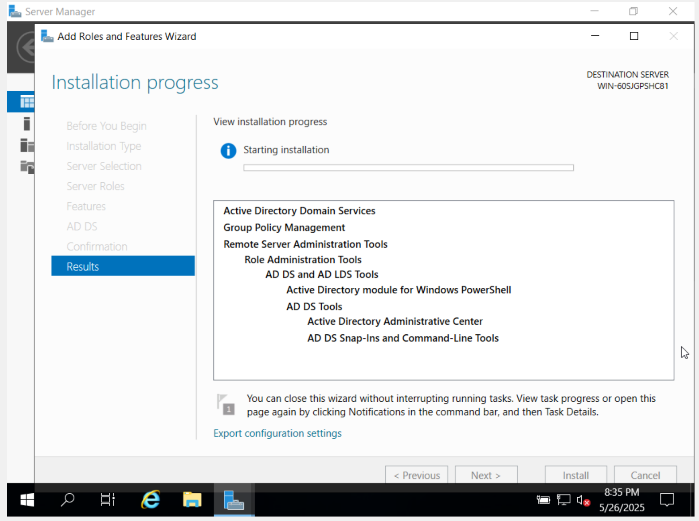
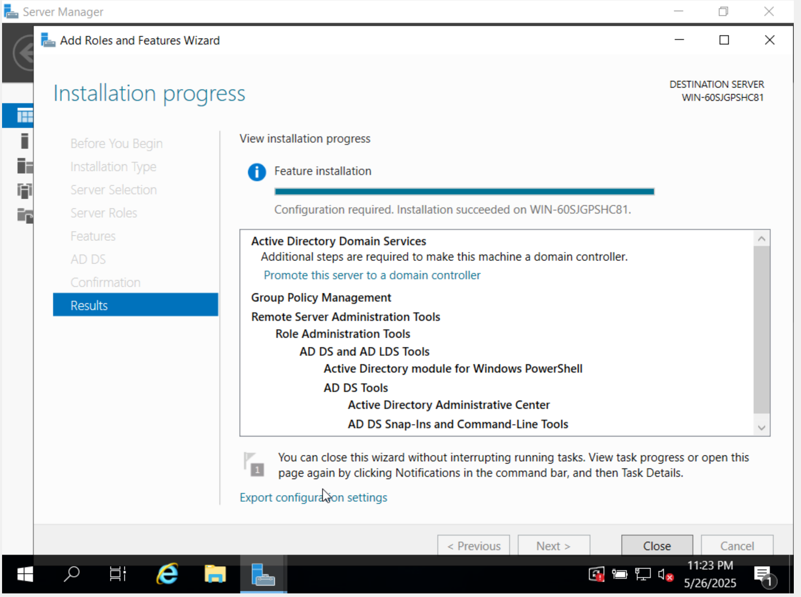
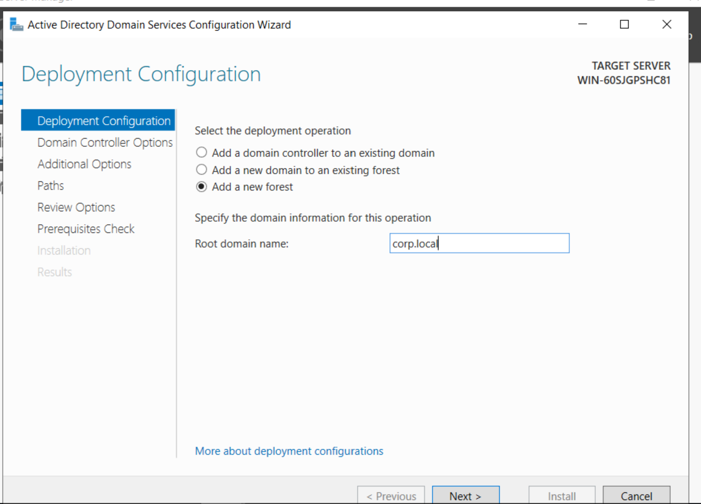
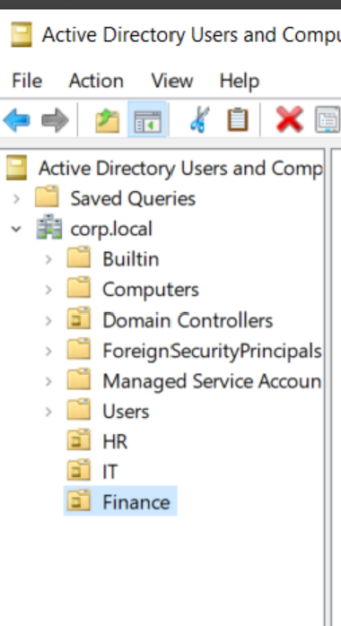
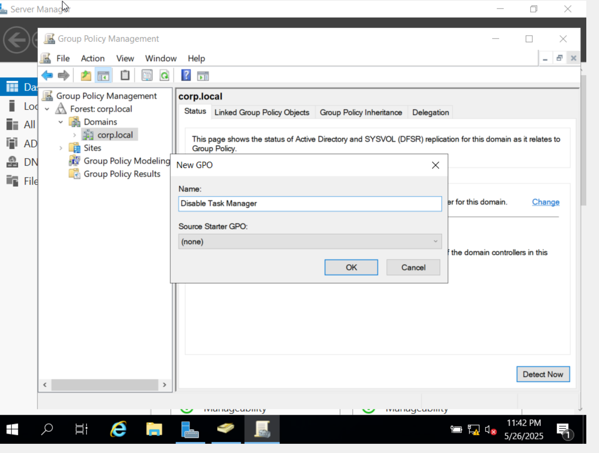
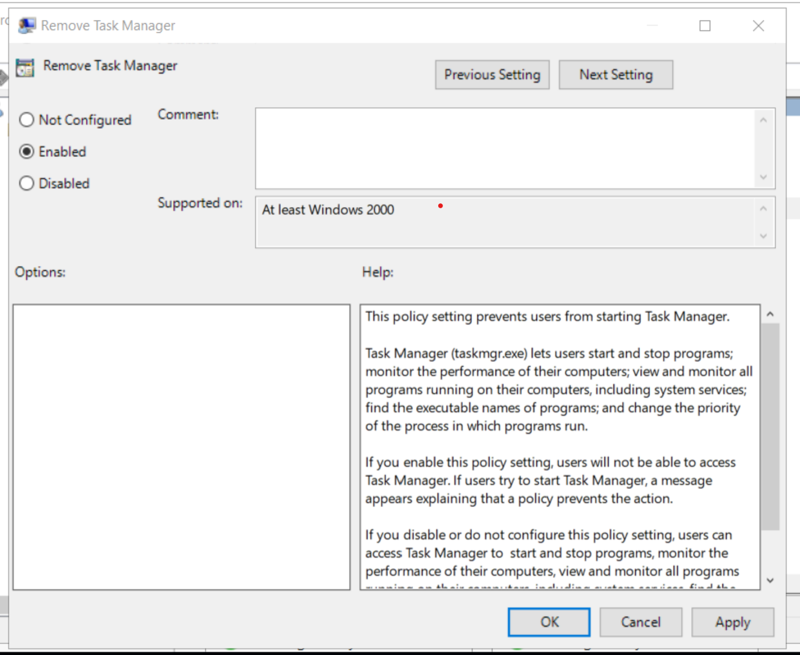
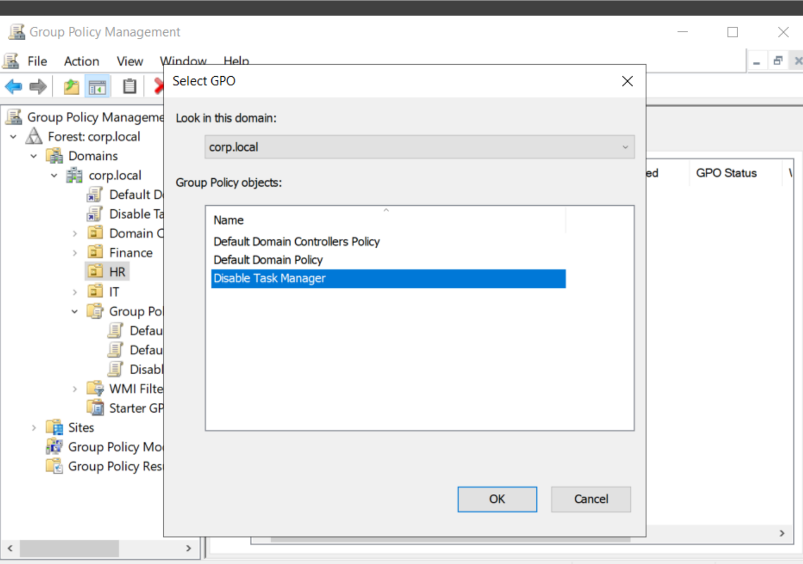
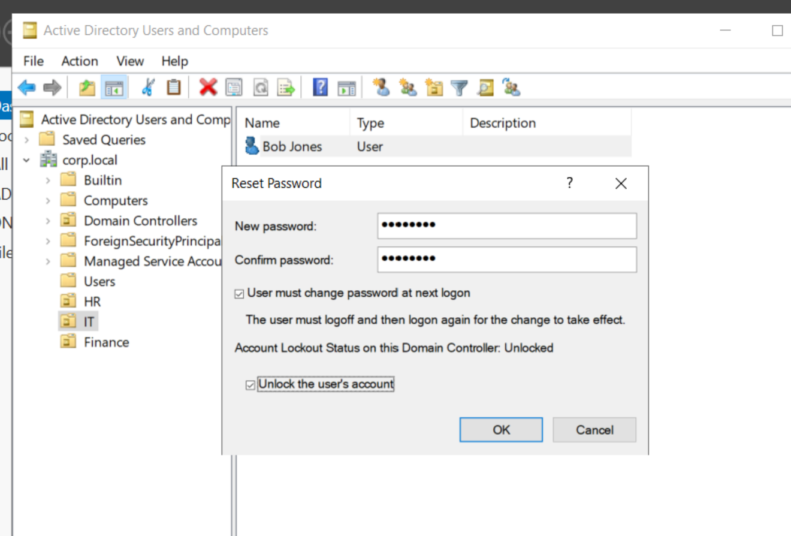

# 🧩 Active Directory User Management & Troubleshooting

## 🎯 Objective
To manage user accounts, permissions, and security policies in Active Directory, ensuring efficient access control and identity management.

## 🛠️ Key Tasks
- Installed and configured AD DS on Windows Server 2019.
- Promoted the server to a domain controller with the domain `corp.local`.
- Created Organizational Units (HR, IT, Finance).
- Created and managed user accounts within each OU.
- Created and linked a Group Policy Object (GPO) to disable Task Manager for HR.
- Reset a user password and unlocked an account.
- Implemented Role-Based Access Control (RBAC) using security groups.

## 💡 Tools Used
- Windows Server 2019
- Active Directory Users and Computers
- Group Policy Management Console
- PowerShell (optional)

## 📸 Screenshots

### 📥 Installing AD DS Role

### 🌐 Domain Configuration

### 🗂️ OU and User Structure

### 🔒 Group Policy to Disable Task Manager

### 🔐 Password Reset and Account Unlock

## ✅ Outcome
Successfully demonstrated user management, group policy enforcement, and account troubleshooting in a domain environment.

---

## 📎 Author
**Dhanuka Bulathsinghala**  
[LinkedIn](https://www.linkedin.com/in/YOUR_USERNAME)
